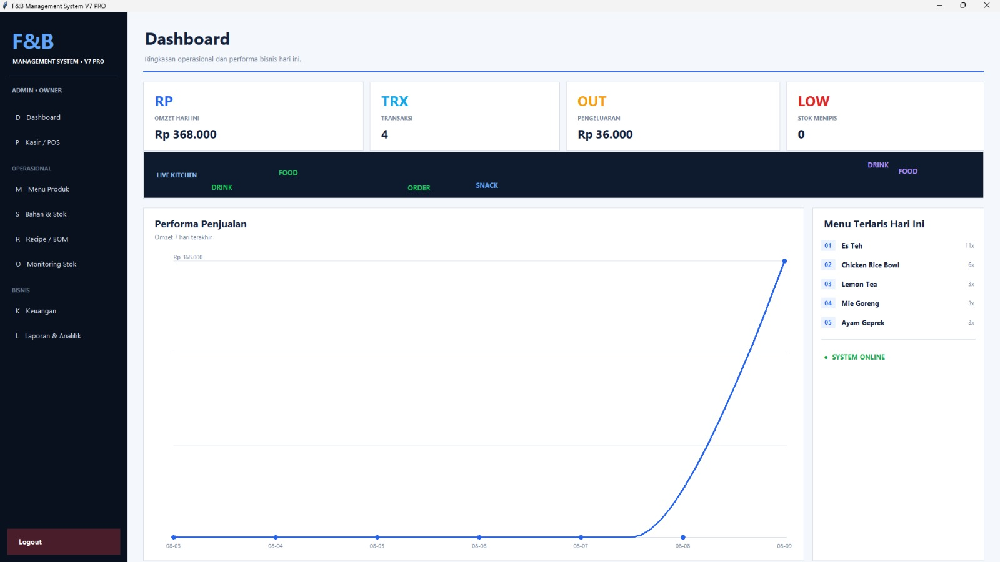

# fnb-management-system
Aplikasi desktop F&amp;B Management System (POS, Stok, Keuangan) berbasis Python &amp; Tkinter
# 🍽️ F&B Management System V7 PRO

Aplikasi desktop berbasis Python untuk membantu operasional UMKM F&B dalam mengelola kasir (POS), inventaris stok bahan baku, dan pemantauan laporan keuangan harian secara terintegrasi.

---

## 📸 Preview Tampilan Aplikasi & Fitur

### 📊 Tampilan Utama
| Dashboard Analitik | Kasir / POS System |
| :---: | :---: |
|  |  |

---

### 📦 Operasional & Manajemen Data
| Monitoring Stok | Manajemen Daftar Menu | Setting Resep (BOM) |
| :---: | :---: | :---: |
|  |  |  |

| Detail Bahan & Stok | Pembayaran & Transaksi | Halaman Login / Auth |
| :---: | :---: | :---: |
|  |  |  |

---

## 🚧 Status Proyek: *Under Development*

Aplikasi ini sedang dalam tahap pengembangan aktif:

### ✅ Fitur Selesai:
- [x] **Login Page & Authentication:** Sistem login terenkripsi.
- [x] **Dashboard Overview:** Visualisasi omzet, grafik penjualan, dan alert stok.
- [x] **Kasir / POS:** Keranjang belanja & pilihan pembayaran (Cash/QRIS/Debit).
- [x] **Manajemen Menu & Stok:** Pemasukan resep (BOM) & batas minimum bahan baku.
- [x] **Monitoring Bahan Baku:** Alert visual untuk stok yang menipis/aman.

### 🛠️ In Progress & Planned:
- [ ] Laporan keuangan ekspor ke Excel/PDF.
- [ ] Multi-user role (Admin vs Kasir).

---

## 🛠️ Tech Stack
- **Language:** Python 3.x
- **GUI:** CustomTkinter / Tkinter
- **Database:** SQLite
